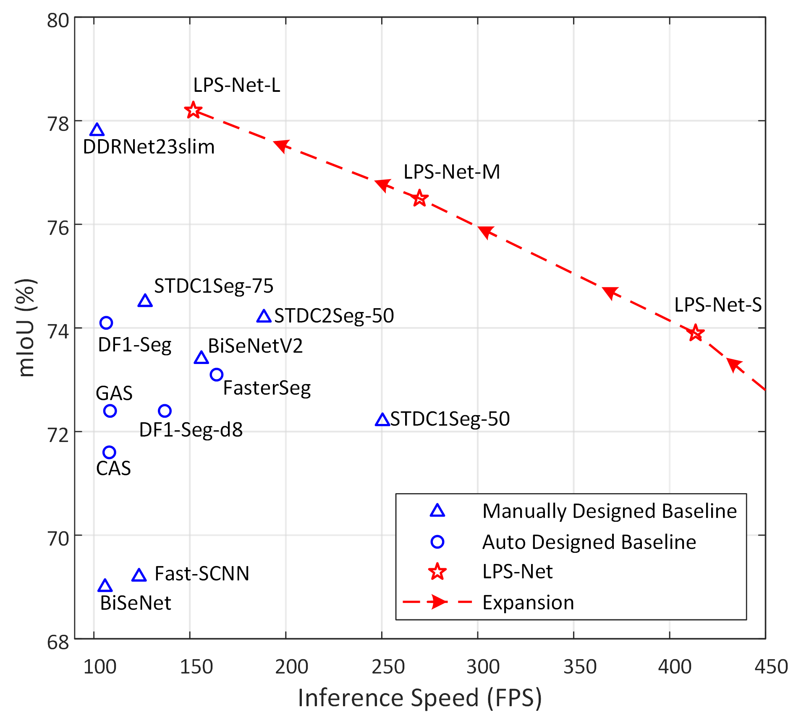

# LPS-Net
Lightweight and Progressively-Scalable Networks for Semantic Segmentation

The original paper can be found [here](https://arxiv.org/pdf/2207.13600.pdf).

<p align="center">
  
</p>

## Getting Started
### Requiremenets
| Package         | Version      |
|-----------------|--------------|
| torch           | 1.9.0+cu111  |
| torchvision     | 0.10.0+cu111 |
| numpy           | 1.21.1       |
| onnx            | 1.10.0       |
| onnx-simplifier | 0.3.6        |
| Pillow          | 8.3.1        |
| TensorRT        | 7.1.3.4      |

### Evaluation in Command Line
To evaluate the LPS-Net-S on the Cityscapes validation set with "val_miou.py", first setup the [Cityscapes](https://www.cityscapes-dataset.com/) dataset and update data path in "imagelist_val.txt"/"val_miou.py" and  (if needed), then run:
```
python val_miou.py
```
The expected output is:
```
Total 500 images for validation.
LPS-Net-S on Cityscapes validation set: mean IoU=73.9%
```

### Measure the Latency
To measure the latency of LPS-Net-S with TensorRT in FP32 mode, run:
```commandline
python latency.py
```
Please ensure the [TensorRT](https://developer.nvidia.com/tensorrt) has been correctly installed and configured.

### Files in Repository
| File              | Content                                                                                                                                                                                  |
|-------------------|------------------------------------------------------------------------------------------------------------------------------------------------------------------------------------------|
| val_miou.py       | Evaluate the mean IoU performance of LPS-Net-S on Cityscapes validation set.                                                                                                             |
| latency.py        | Measure the latency of LPS-Net with TensorRT in FP32 mode.                                                                                                                               |
| lpsnet.py         | Definitions and implementation of LPS-Net.                                                                                                                                               |
| expand.py         | Progressive expansion of LPS-Net.                                                                                                                                                        |
| LPS-Net-S.pth     | Weights of LPS-Net-S. It is trained on the Cityscapes training set.                                                                                                                      |
| imagelist_val.txt | A list of image-label pairs on the Cityscapes validation set. It is utilized to evaluate mean IoU performace in "val_miou.py". Note that the label images should use official "trainId". |


## Citation
Cite as below if you find this repository is helpful:
```
@article{zhang2022lpsnet,
  title   = {Lightweight and Progressively-Scalable Networks for Semantic Segmentation},
  author  = {Zhang, Yiheng and Yao, Ting and Qiu, Zhaofan and Mei, Tao},
  journal = {ArXiv},
  year    = {2022},
  volume  = {abs/2207.13600}
}
```